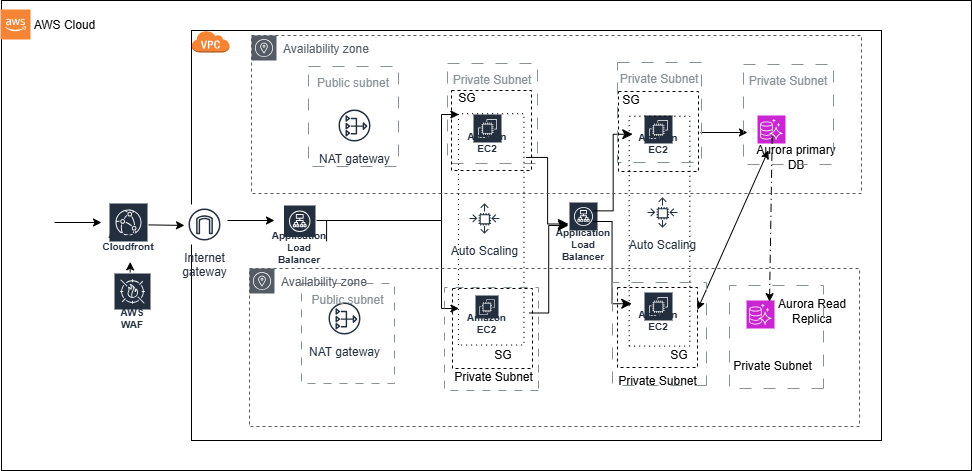
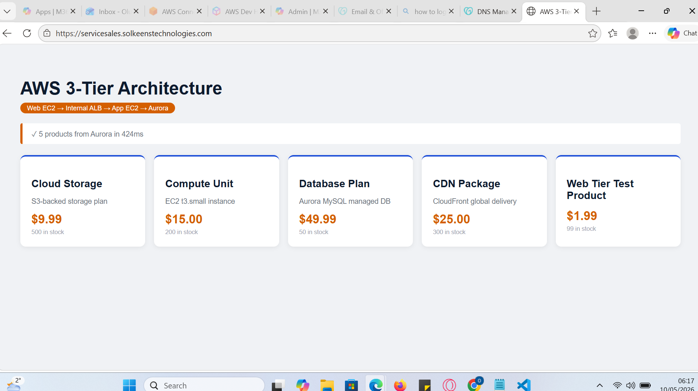

# 🚀 Production-Grade AWS 3-Tier Product Catalogue Platform


## Project Overview

This project demonstrates the design, deployment, and operation of a **production-grade 3-tier web application architecture on AWS**.

The solution serves a live product catalogue through a globally distributed infrastructure utilizing AWS networking, security, compute, database, and monitoring services. The architecture follows enterprise cloud design principles including:

* High Availability
* Scalability
* Security by Design
* Network Segmentation
* Secrets Management
* Load Balancing
* Observability
* Disaster Recovery Readiness

The application is deployed using Amazon EC2, Aurora MySQL, CloudFront, WAF, Application Load Balancers, Auto Scaling Groups, and AWS Secrets Manager.

---

# 🏗 Architecture Diagram



## Architecture Flow

Browser (HTTPS)
 → CloudFront (WAF + TLS termination)
   → External ALB (public)
     → Web EC2 (Nginx:80 → Node.js:3000)
       → Internal ALB (private)
         → App EC2 (Flask:5000)
           → Aurora MySQL (private DB subnets)

---


### Application Screenshot



### Demonstrated Functionality

The live deployment verifies:

✅ CloudFront global content delivery

✅ AWS WAF protection

✅ HTTPS/TLS encryption

✅ Public ALB request routing

✅ Node.js Web Tier

✅ Internal ALB communication

✅ Flask API Application Tier

✅ Aurora MySQL integration

✅ Secrets Manager credential retrieval

✅ Private subnet architecture

✅ Multi-tier communication

The screenshot above shows product data dynamically retrieved from Aurora MySQL and rendered through the full application stack.

---

# 🎯 Business Scenario

A retail organization requires a secure and scalable platform capable of serving product information to customers globally.

The solution must provide:

* Global low-latency access
* Secure application delivery
* High availability
* Database redundancy
* Operational visibility
* Elastic scaling
* Protection against common web attacks

This architecture was designed to satisfy those requirements while following AWS Well-Architected Framework principles.

---

# 🧱 AWS Services Used

| Service                   | Purpose                         |
| ------------------------- | ------------------------------- |
| Amazon VPC                | Network isolation               |
| Public Subnets            | Load balancers and NAT Gateways |
| Private Subnets           | Web, App, and Database tiers    |
| Internet Gateway          | External connectivity           |
| NAT Gateway               | Secure outbound internet access |
| CloudFront                | Global CDN                      |
| AWS WAF                   | Web application protection      |
| Application Load Balancer | Traffic distribution            |
| EC2 Auto Scaling Groups   | Elastic compute scaling         |
| Amazon Aurora MySQL       | Managed relational database     |
| AWS Secrets Manager       | Secure credential storage       |
| IAM Roles                 | Least privilege access          |
| Amazon CloudWatch         | Monitoring and logging          |

---

# 🔒 Security Architecture

Security was implemented across every layer of the solution.

## Network Security

* Private subnets for Web and App tiers
* Aurora deployed in isolated database subnets
* Security Groups enforce tier-to-tier communication
* No direct database access from the internet

## Identity & Access Management

* IAM Roles attached to EC2 instances
* No hardcoded AWS credentials
* Principle of Least Privilege

## Secrets Management

Database credentials are securely stored in AWS Secrets Manager and retrieved dynamically by the Flask API.

```python
secret = client.get_secret_value(
    SecretId='prod/aurora/credentials'
)
```

## Edge Protection

* AWS WAF protects against common attacks
* HTTPS enforced through CloudFront
* TLS termination at the edge

---

# ⚙ Application Components

## Web Tier

### Technologies

* Node.js
* Express.js
* Nginx

### Responsibilities

* Serve frontend content
* Proxy API requests
* Handle client communication
* Load balancing integration

---

## Application Tier

### Technologies

* Python
* Flask
* Gunicorn

### Responsibilities

* REST API processing
* Database communication
* Business logic
* Secrets retrieval

---

## Database Tier

### Technology

Amazon Aurora MySQL

### Features

* Managed database service
* Read replica support
* Automated backups
* High availability
* Multi-AZ architecture

---

# 📡 API Endpoints

## Health Check

```http
GET /api/health
```

Response:

```json
{
  "status": "healthy",
  "tier": "app"
}
```

---

## Get Products

```http
GET /api/products
```

---

## Get Single Product

```http
GET /api/products/{id}
```

---

## Create Product

```http
POST /api/products
```

Request:

```json
{
  "name": "Cloud Storage",
  "description": "S3-backed storage",
  "price": 9.99,
  "stock": 500
}
```

---

## Delete Product

```http
DELETE /api/products/{id}
```

---

# 📈 Scalability Design

The platform is designed to scale horizontally.

## Web Tier Scaling

* Auto Scaling Group
* Public ALB distribution
* CloudFront caching

## Application Tier Scaling

* Auto Scaling Group
* Internal ALB distribution

## Database Scaling

* Aurora Reader Endpoint
* Read Replica support
* Managed failover capabilities

---

# 📊 Monitoring & Observability

Monitoring capabilities include:

* CloudWatch Metrics
* CloudWatch Logs
* Application Health Checks
* ALB Target Health Monitoring
* EC2 Status Checks
* Service Availability Monitoring

Example Health Endpoint:

```http
GET /health
```

Returns:

```json
{
  "status": "healthy",
  "tier": "web"
}
```

---

# 📂 Repository Structure

```text
aws-3tier-product-catalogue/

├── images/
│   ├── aws-3tier-architecture.png
│   └── application-demo.png
│
├── app-tier/
│   ├── app.py
│   ├── requirements.txt
│   ├── systemd/
│   └── scripts/
│
├── web-tier/
│   ├── server.js
│   ├── package.json
│   ├── public/
│   ├── nginx/
│   └── systemd/
│
└── README.md
```

---

# 🛠 Key Engineering Skills Demonstrated

## Cloud Engineering

* AWS Architecture Design
* VPC Design & Networking
* Security Architecture
* High Availability
* Load Balancing
* Auto Scaling

## DevOps

* Linux Administration
* Nginx Configuration
* Systemd Service Management
* Monitoring & Logging
* Troubleshooting

## Backend Development

* Python Flask APIs
* Node.js Services
* REST API Design
* Database Integration
* Secrets Management

## Solutions Architecture

* Three-Tier Architecture
* Security Best Practices
* Scalability Planning
* Reliability Engineering
* Production Readiness

---

# 🚀 Future Enhancements

Planned improvements include:

* Terraform Infrastructure as Code
* GitHub Actions CI/CD Pipeline
* Docker Containerization
* Amazon ECS Deployment
* Amazon EKS Deployment
* AWS X-Ray Distributed Tracing
* CloudWatch Dashboards
* Blue/Green Deployments

---

# 🏆 Project Outcomes

This project demonstrates the ability to:

* Design secure AWS environments
* Deploy production-grade workloads
* Build scalable cloud-native applications
* Implement enterprise security controls
* Operate highly available systems
* Integrate multiple AWS managed services
* Deliver end-to-end cloud solutions

---

